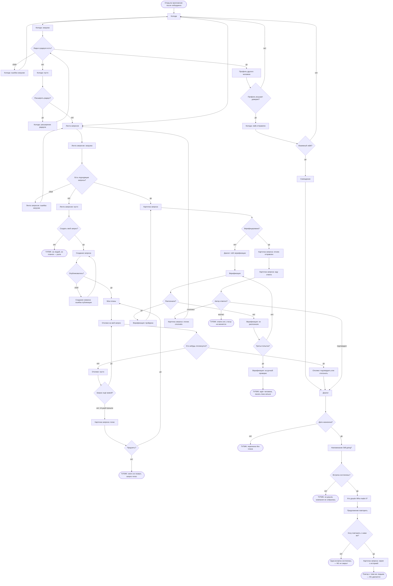
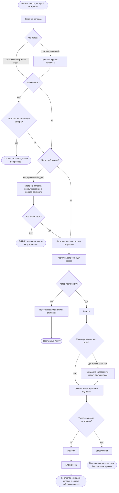
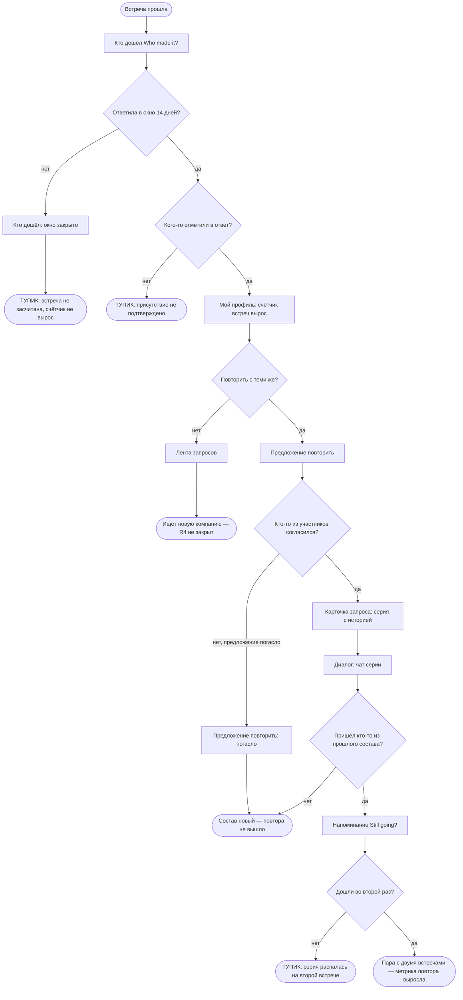

# User flows — MeetMates

> Экраны и состояния — из [`sitemap.md`](./sitemap.md), новых не придумано.
> Jobs — из [`research/jtbd.md`](./research/jtbd.md), решения — [`DECISIONS.md`](./DECISIONS.md).
>
> **Как читать.** Прямоугольник — экран или его состояние, ромб — точка решения,
> закруглённый — начало или конец пути. Тупики помечены словом **ТУПИК** в тексте узла:
> это места, где человек может застрять, и именно они важнее happy-path.

---

## M1 — компания для планов и продолжение

> Когда мне есть куда пойти, но не с кем, я хочу, чтобы у моих планов была компания,
> а у компании — продолжение.

**Кто:** Даша, primary. **Путь считается от пустой колоды** — на старте она увидит именно её (`D-22`).

**Точки решения.**

1. **Люди в радиусе есть?** — на старте чаще «нет»: плотность главный риск (`D-02`).
2. **Расширить радиус?** — по `D-11` спрашиваем один раз, дальше помним.
3. **Профиль внушает доверие?** — решают четыре сигнала до первого сообщения (правило 12).
4. **Взаимный лайк?** — вероятность, а не действие; поэтому путь через планы считается основным.
5. **Есть подходящие запросы?** / **Создать свой?** — развилка, где ломается или держится `D-22`.
6. **Верифицирована?** — гейт стоит перед контактом, не на входе (`D-03`).
7. **Распознали?** и **третья попытка?** — пересдача безлимитная, после двух неудач человек (`D-26`).
8. **Автор ответил?** — асимметрия отклика: место не занято, пока не подтвердил.
9. **Дата назначена?** — без даты нечего напоминать и нечего засчитывать (`D-23`).
10. **Хочу повторить?** — единственный переход, который двигает M1 по существу.
    Предложение приходит **отдельно от check-in** и доступно любому участнику (`D-34`):
    экран «Кто дошёл» стоит рядом на схеме, но повтор от него не зависит.

**Состояния в потоке.** Загрузка колоды и ленты · пусто в колоде, ленте и откликах ·
ошибка загрузки колоды и ленты · ошибка публикации запроса · расширение радиуса ·
гейт верификации · не распознали · на ручной проверке · жду ответа · отклик отклонён ·
запрос погас.

**Шесть тупиков.** Ни людей, ни планов · никто не откликнулся и запрос погас ·
ждёт ручной проверки · автор молчит · переписка без плана · не дошли.
**Пятый и шестой — самые дорогие:** там человек уже вложился, а компании нет.

---

## R2 — решиться идти

> Когда до встречи с человеком из интернета остаётся вечер и я решаю, идти ли, —
> я хочу, чтобы риск был мне понятен до того, как я выйду из дома.

**Кто:** Даша, primary.

**Точки решения.**

1. **Кто автор?** — если четырёх сигналов на карточке мало, человек уходит в профиль целиком.
2. **Verified есть?** — единственный сигнал, который что-то доказывает; и то только живое фото (`D-26`).
3. **Место публичное?** — публичное по умолчанию, приватное показывает предупреждение (`D-07`).
4. **Хочу ограничить, кто идёт?** — только на свой пол (`D-25`); ветка работает, если она автор.
5. **Тревожно после разговора?** — Report и Block доступны с любого экрана (правило 4).

**Состояния.** Предупреждение о приватном месте · жду ответа · отклик отклонён.

**Два тупика, и оба — осознанный отказ, а не сбой:** не пошла, потому что автор
не верифицирован; не пошла, потому что место не устраивает. Продукт их не «чинит» —
он делает так, чтобы решение принималось **дома**, а не у двери.

---

## R4 — увидеться снова, не начиная заново

> Когда встреча прошла хорошо и я хочу повторить — а договариваться заново с каждым
> значит снова писать первой, — я хочу продолжить с теми же людьми без усилия первого раза.

**Кто:** Максим и Оля (secondary), Даша (primary) — источник Холла измерен на переехавших.

**Точки решения.**

1. **Ответила в окно?** — окно 14 дней, пропустить можно; при заполняемости ниже 40 %
   механизм репутации не наполняется (`D-18`).
2. **Кого-то отметили в ответ?** — присутствие засчитано, если отметил хотя бы один другой.
3. **Кто-то согласился?** — предложение повторить приходит **после встречи любому участнику**
   и не зависит от check-in (`D-34`). Прежняя развилка «запрос был помечен как повторяющийся?»
   снята: она спрашивала о повторе до того, как человек мог о нём судить, и роняла R4 тихо.
4. **Пришёл кто-то из прошлого состава?** — вторичный срез метрики повтора (§11).

**Состояния.** Окно check-in закрыто · предложение повторить погасло · серия с историей · чат серии.

**Три тупика.** Не ответила в окно · присутствие не подтвердил никто ·
серия распалась на второй встрече. Первые два — **дыры в измерении**: встреча была,
но продукт о ней не знает, и метрика повтора читается как нижняя граница.

---

## R3 — не приехать к пустому столу

> Когда я решаю, ехать ли на встречу, где записалось восемь незнакомых людей, —
> я хочу быть уверенной, что не окажусь там одна.

**Кто:** Оля и Артём — **secondary-flow**. По матрице R3 не принадлежит Даше; на `+1`
пустого стола не бывает. Это первое, что стоит перепроверить на интервью `[?]`.

**Точки решения.**

1. **Ответила?** — три исхода, и молчание не равно отказу (`D-16`).
2. **Молчание освобождает место?** — **нет**: неответ не проступок, `spots left` не растёт.
3. **Сколько подтвердило?** — на `+1` ответ всегда «только я или никто»,
   поэтому этот flow и не про Дашу.
4. **Кто-то дошёл кроме меня?** — единственная проверка, которая закрывает job фактом.

**Состояния.** Счётчик `going` · счётчик `confirmed` · место освободилось · `1 confirmed`.

**Два тупика.** Не поехала, потому что подтвердил один · приехала к пустому столу.
**Второй — это провал job целиком**, и продукт против него может только предупредить
заранее: показать `confirmed`, а не `going` (`D-16`).

---

## Что эти flows показали

| Находка | Куда идёт |
|---|---|
| **Шесть тупиков в M1**, два из них после того, как человек уже вложился | Проектировать выход из «автор молчит» и «переписка без плана» — §5.4 |
| **Ошибки загрузки и публикации** не были описаны как состояния | Добавлены в `sitemap.md` |
| **«Отклик отклонён» и «отклики: пусто»** не были состояниями | Добавлены в `sitemap.md` |
| ~~R4 ломается на развилке «запрос не был помечен повторяющимся»~~ | **Решено `D-34`:** повтор предлагается после встречи, начать может любой участник |
| **R3 на `+1` вырождается** — подтверждает, что flow secondary | Перепроверить владение R3 на интервью |
