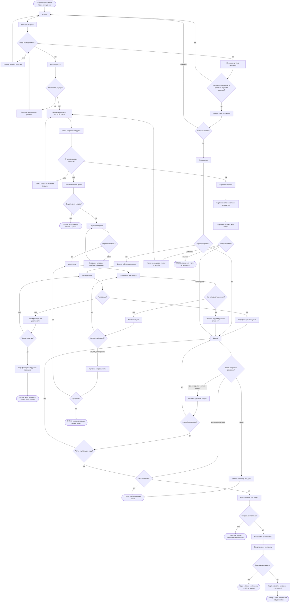
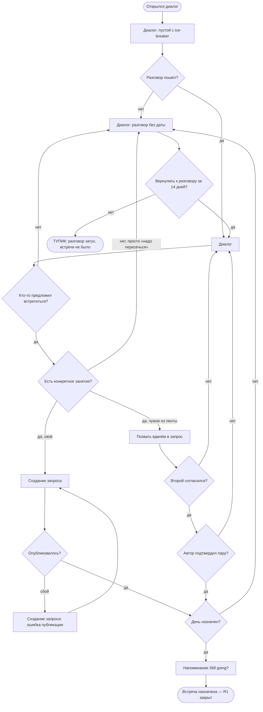
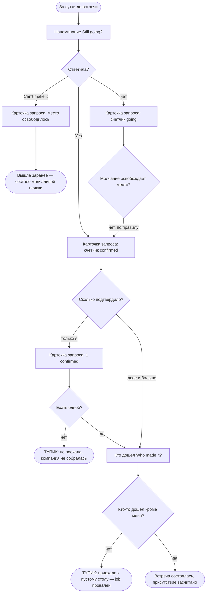

# User flows — MeetMates

> Экраны и состояния — из [`sitemap.md`](./sitemap.md), новых не придумано.
> Jobs — из [`research/jtbd.md`](./research/jtbd.md), решения — [`DECISIONS.md`](./DECISIONS.md).
>
> **Как читать.** Прямоугольник — экран или его состояние, ромб — точка решения,
> закруглённый — начало или конец пути. Тупики помечены словом **ТУПИК** в тексте узла:
> это места, где человек может застрять, и именно они важнее happy-path.

---

## M1 — компания для планов и продолжение

> Когда мне есть куда пойти, но не с кем, я хочу, чтобы у моих планов была компания,
> а у компании — продолжение.

**Кто:** Даша, primary.
**Основной путь — через чат** `D-37`: колода → взаимный свайп → диалог → договорились.
**Второй путь** — лента запросов: он не зависит от взаимности и потому не убран в глубину.
Считается от **пустой колоды**: на старте она увидит именно её (`D-22`).

**Оба пути сходятся в диалоге.** Дальше — одинаково: разговор, выход из него в день,
встреча, повтор. Это и есть смысл `D-37`: чат не финал знакомства, а дорога к встрече.

**Точки решения.**

1. **Люди в радиусе есть?** — на старте чаще «нет»: плотность главный риск (`D-02`).
2. **Расширить радиус?** — спрашиваем один раз, дальше помним (`D-11`).
3. **Интересы совпадают и профиль внушает доверие?** — на карточке первой строкой
   общие интересы (`D-13`), под ними четыре сигнала доверия (правило 12).
4. **Взаимный лайк?** — **не тупик, а ожидание**, и это цена `D-37`: основной путь
   упирается в чужое решение. Второй путь от взаимности не зависит.
5. **Верифицирована?** — гейт срабатывает в момент максимальной мотивации (`D-03`).
6. **Как выходим из разговора?** — три выхода: договориться самим, позвать друг друга
   вдвоём в чужой запрос (`D-36`), никак. Третий — провал R1.
7. **Второй согласился?** и **автор подтвердил пару?** — пара атомарна: берут обоих
   или никого (`D-36`).
8. **Дата назначена?** — без даты нечего напоминать и нечего засчитывать (`D-23`).
9. **Повторить с ними же?** — единственный переход, который двигает M1 по существу.

**Состояния в потоке.** Загрузка колоды и ленты · пусто в колоде, ленте и откликах ·
ошибка загрузки колоды и ленты · ошибка публикации · расширение радиуса · лайк отправлен ·
гейт верификации · не распознали · на ручной проверке · **разговор без даты** ·
ждёт согласия второго · жду ответа · отклик отклонён · запрос погас.

**Шесть тупиков.**

| Тупик | Где | Чем дорог |
|---|---|---|
| Ждёт ручной проверки | Верификация | Писать нельзя, а матч уже есть |
| **Переписка без плана** | Диалог | **Главный тупик основного пути**: разговор состоялся, встречи нет |
| Не дошли | После напоминания | Договорились и не встретились |
| Ни людей, ни планов | Пустая лента | Старт, когда база пуста |
| Никто не позвал | Свой запрос погас | Вложилась в создание — ноль откликов |
| Автор молчит | Отклик | Статус не меняется, выхода из состояния нет |

**«Взаимного лайка нет» тупиком не считается** — это ожидание, из которого колода
выводит обратно. Тупик там, где человек **не может ничего сделать дальше**.

---

## R1 — довести разговор до встречи

> Когда мы совпали и переписка идёт, а до встречи не доходит — «надо как-нибудь
> пересечься» и тишина, — я хочу, чтобы у разговора был выход в конкретный день.

**Кто:** Даша и Оля. **Центральный job основного пути** `D-37`: всё, что до диалога,
ведёт сюда, всё, что после, — уже следствие.

**Точки решения.**

1. **Разговор пошёл?** — ice-breaker в пустом чате существует ради этой развилки.
2. **Кто-то предложил встретиться?** — самый частый провал в категории:
   «we should definitely grab a coffee… no date is set, the conversation dies»
   (FirstMove, **C**).
3. **Есть конкретное занятие?** — «надо пересечься» это **не** выход: по `D-23`
   занятие обязательно, и здесь та же граница, что между запросом и анкетой.
4. **Своё или чужое?** — два выхода из чата: создать свой план или позвать друг друга
   в чужой вдвоём (`D-36`).
5. **День назначен?** — дата появляется при договорённости, а не при создании (`D-23`).

**Состояния.** Пустой диалог с ice-breaker · **разговор без даты** ·
ошибка публикации · ждёт согласия второго.

**Один тупик, и он же главный тупик продукта:** разговор затух. Формально ничего
не сломалось — люди совпали, поговорили, — но M1 не сдвинулся ни на шаг.
**Метрика:** доля диалогов, дошедших до назначенного дня; в §11 её пока нет `[?]`.

---

## R2 — решиться идти

> Когда мы уже списались и пора договариваться о встрече — а всё, что я о нём знаю,
> он рассказал о себе сам, — я хочу понимать, чем рискую, до того как соглашусь
> на место и время.

**Кто:** Даша, primary.

**Точки решения.**

1. **Кто автор?** — если четырёх сигналов на карточке мало, человек уходит в профиль целиком.
2. **Verified есть?** — единственный сигнал, который что-то доказывает; и то только живое фото (`D-26`).
3. **Место публичное?** — публичное по умолчанию, приватное показывает предупреждение (`D-07`).
4. **Хочу ограничить, кто идёт?** — только на свой пол (`D-25`); ветка работает, если она автор.
5. **Тревожно после разговора?** — Report и Block доступны с любого экрана (правило 4).

**Состояния.** Предупреждение о приватном месте · жду ответа · отклик отклонён.

**Два тупика, и оба — осознанный отказ, а не сбой:** не пошла, потому что автор
не верифицирован; не пошла, потому что место не устраивает. Продукт их не «чинит» —
он делает так, чтобы решение принималось **дома**, а не у двери.

---

## R4 — увидеться снова, не начиная заново

> Когда встреча прошла хорошо и я хочу повторить — а договариваться заново с каждым
> значит снова писать первой, — я хочу продолжить с теми же людьми без усилия первого раза.

**Кто:** Максим и Оля (secondary), Даша (primary) — источник Холла измерен на переехавших.

**Точки решения.**

1. **Ответила в окно?** — окно 14 дней, пропустить можно; при заполняемости ниже 40 %
   механизм репутации не наполняется (`D-18`).
2. **Кого-то отметили в ответ?** — присутствие засчитано, если отметил хотя бы один другой.
3. **Кто-то согласился?** — предложение повторить приходит **после встречи любому участнику**
   и не зависит от check-in (`D-34`). Прежняя развилка «запрос был помечен как повторяющийся?»
   снята: она спрашивала о повторе до того, как человек мог о нём судить, и роняла R4 тихо.
4. **Пришёл кто-то из прошлого состава?** — вторичный срез метрики повтора (§11).

**Состояния.** Окно check-in закрыто · предложение повторить погасло · серия с историей · чат серии.

**Три тупика.** Не ответила в окно · присутствие не подтвердил никто ·
серия распалась на второй встрече. Первые два — **дыры в измерении**: встреча была,
но продукт о ней не знает, и метрика повтора читается как нижняя граница.

---

## R3 — не приехать к пустому столу

> Когда я решаю, ехать ли на встречу, где записалось восемь незнакомых людей, —
> я хочу быть уверенной, что не окажусь там одна.

**Кто:** Оля и Артём — **secondary-flow** `D-35`. На `+1` пустого стола не бывает:
вопрос «сколько подтвердило» вырождается в «только я или никто».
**Но экран напоминания рисуется сначала под пару** — там молчание единственного участника
означает, что встречи не будет вовсе (`D-24`).

**Точки решения.**

1. **Ответила?** — три исхода, и молчание не равно отказу (`D-16`).
2. **Молчание освобождает место?** — **нет**: неответ не проступок, `spots left` не растёт.
3. **Сколько подтвердило?** — на `+1` ответ всегда «только я или никто»,
   поэтому этот flow и не про Дашу `D-35`. Механизм при этом на паре не слабее,
   а сильнее: один неответ означает, что встречи нет.
4. **Кто-то дошёл кроме меня?** — единственная проверка, которая закрывает job фактом.

**Состояния.** Счётчик `going` · счётчик `confirmed` · место освободилось · `1 confirmed`.

**Два тупика.** Не поехала, потому что подтвердил один · приехала к пустому столу.
**Второй — это провал job целиком**, и продукт против него может только предупредить
заранее: показать `confirmed`, а не `going` (`D-16`).

---

## Что эти flows показали

| Находка | Куда идёт |
|---|---|
| **Шесть тупиков в M1**, два из них после того, как человек уже вложился | Проектировать выход из «автор молчит» и «переписка без плана» — §5.4 |
| **Ошибки загрузки и публикации** не были описаны как состояния | Добавлены в `sitemap.md` |
| **«Отклик отклонён» и «отклики: пусто»** не были состояниями | Добавлены в `sitemap.md` |
| ~~R4 ломается на развилке «запрос не был помечен повторяющимся»~~ | **Решено `D-34`:** повтор предлагается после встречи, начать может любой участник |
| ~~R3 на `+1` вырождается~~ | **Решено `D-35`:** R3 остаётся групповым, но экран напоминания рисуется pair-first |
| **Главный тупик продукта — «разговор без даты»** | Стал именованным состоянием диалога; выход из чата спроектирован в §5.3 |
| **У R1 не было метрики**, хотя после `D-37` это центральный job основного пути | **Добавлена в §11:** доля диалогов, дошедших до назначенного дня |
| **«Взаимного лайка нет» — не тупик, а ожидание** | Цена `D-37`: основной путь упирается в чужое решение, поэтому второй путь остаётся глобальным |
