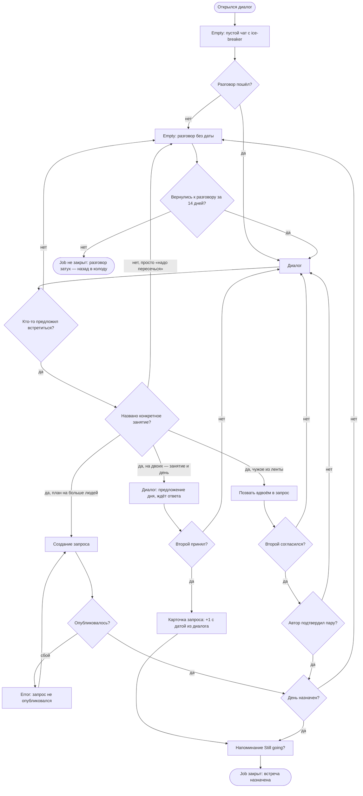
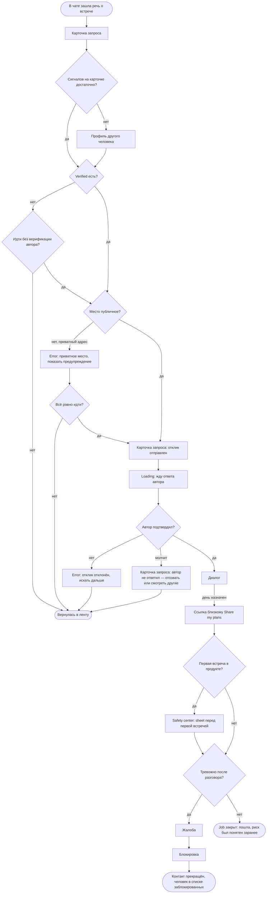
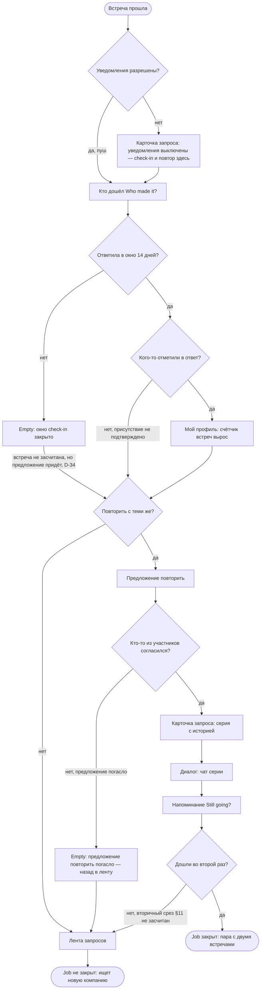
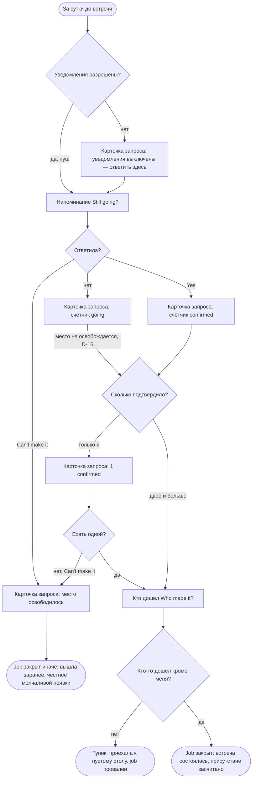
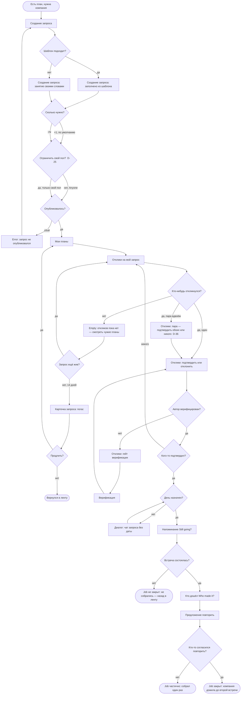
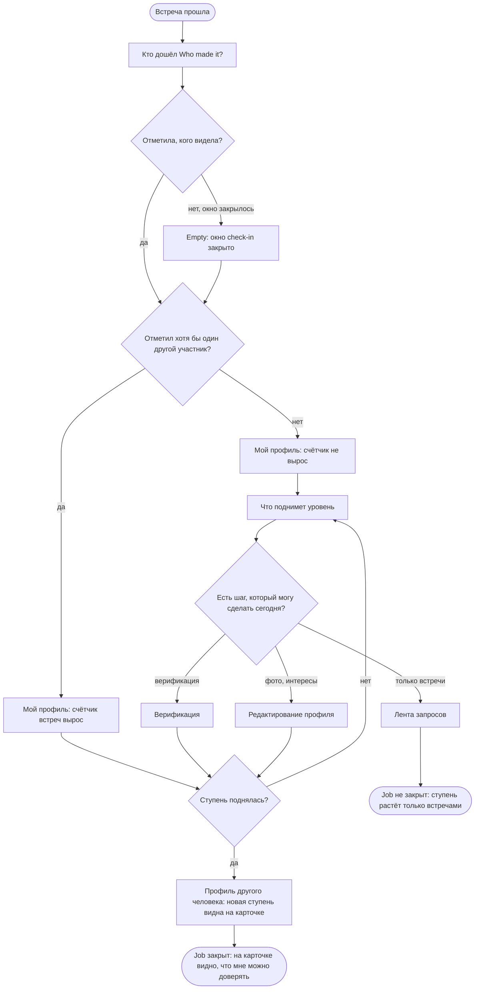

# User flows — MeetMates

> Экраны и состояния — из [`sitemap.md`](./sitemap.md), новых не придумано.
> Jobs — из [`research/jtbd.md`](./research/jtbd.md): main job, четыре related, поток автора
> и trust loop; решения — [`DECISIONS.md`](./DECISIONS.md).
>
> **Разметка.** Все диаграммы — `flowchart TD`, одна запись на весь файл:
>
> | Запись | Что означает |
> |---|---|
> | `Name([текст])` | начало или конец пути |
> | `Name[текст]` | экран |
> | `Name["Loading: …"]` · `["Empty: …"]` · `["Error: …"]` | **состояние** экрана, тип назван в тексте |
> | `Name{вопрос?}` | точка решения |
> | `-->|да\|нет|` | ветвь решения |
> | `(["Job закрыт: …"])` | job закрыт |
> | `(["Тупик: …"])` | **тупик** — человек не может ничего сделать дальше |
> | `(["Job не закрыт: … — назад в колоду"])` · `([Вернулась в ленту])` | конец пути **с возвратом** на экран; «Тупик» — только когда действия нет |
>
> Тупики важнее happy-path: именно там продукт теряет человека.
>
> **У каждого потока два блока:** сначала разметка текстом — её видно и можно
> скопировать, — потом та же разметка в блоке `mermaid`, которую GitHub рисует.
> **При правке меняются оба.**

---

## M1 — компания для планов и продолжение

> Когда мне есть куда пойти, но не с кем, я хочу, чтобы у моих планов была компания,
> а у компании — продолжение.

**Кто:** Даша, primary.
**Основной путь — через чат** `D-37`: колода → взаимный свайп → диалог → договорились.
**Второй путь** — лента запросов: он не зависит от взаимности и потому не убран в глубину.
Считается от **пустой колоды**: на старте она увидит именно её (`D-22`).
Радар `D-47` в поток не входит: он показывается один раз в онбординге
и данными продукта не управляет.

**Разметка `flowchart TD`:**

```
flowchart TD
    Start([Открыла приложение после онбординга]) --> Deck[Колода]
    Deck --> DeckLoad["Loading: грузим людей рядом"]
    DeckLoad --> HasPeople{Есть люди в радиусе?}

    HasPeople -->|сбой| DeckErr["Error: колода не загрузилась"]
    DeckErr --> Deck
    HasPeople -->|нет| DeckEmpty["Empty: людей рядом нет, расширить радиус или посмотреть планы"]
    HasPeople -->|да| Person[Профиль другого человека]

    DeckEmpty --> WiderRadius{Расширить радиус?}
    WiderRadius -->|да| Radius["Колода: расширение радиуса"]
    Radius --> HasPeople
    WiderRadius -->|нет| Feed

    Person --> Trust{Интересы совпадают и профиль внушает доверие?}
    Trust -->|нет| Deck
    Trust -->|да| Like["Колода: лайк отправлен"]
    Like --> Mutual{Взаимный лайк?}
    Mutual -->|пока нет| Deck
    Mutual -->|да| Match[Совпадение]

    Match --> IsVerified{Верифицирована?}
    IsVerified -->|нет| Gate["Диалог: гейт верификации"]
    Gate --> Now{Верифицироваться сейчас?}
    Now -->|да| Verify[Верификация]
    Now -->|позже| BackToDeck(["Вернулась в колоду — матч и гейт остались"])
    Verify --> Recognised{Распознали?}
    Recognised -->|да| VerifyOk["Верификация: пройдена"]
    VerifyOk --> Dialog
    Recognised -->|нет| VerifyFail["Error: не распознали, назвать причину и дать пересдать"]
    VerifyFail --> Twice{Вторая неудача подряд?}
    Twice -->|нет| Verify
    Twice -->|да| Manual["Верификация: на ручной проверке"]
    Manual --> ManualGate["Диалог: гейт — на проверке, писать пока нельзя"]
    ManualGate --> ManualResult{Результат проверки?}
    ManualResult -->|пройдена| VerifyOk
    ManualResult -->|отказ с причиной| VerifyFail
    IsVerified -->|да| Dialog[Диалог]

    Dialog --> Exit{Как выходим из разговора?}
    Exit -->|никак| DeadChat["Empty: разговор без даты"]
    DeadChat --> Revived{Вернулись к разговору за 14 дней?}
    Revived -->|да| Dialog
    Revived -->|нет| NoPlan(["Job не закрыт: разговор затух — назад в колоду"])
    Exit -->|предложила день — занятие и дата| DayOffer["Диалог: предложение дня, ждёт ответа"]
    DayOffer --> DayOK{Второй принял?}
    DayOK -->|нет| Dialog
    DayOK -->|да| FromChat["Карточка запроса: +1 с датой из диалога"]
    FromChat --> Remind
    Exit -->|зовём вдвоём в чужой запрос| Pair[Позвать вдвоём в запрос]

    Pair --> SecondAgrees{Второй согласился?}
    SecondAgrees -->|нет| Dialog
    SecondAgrees -->|да| AuthorPair{Автор подтвердил пару?}
    AuthorPair -->|нет| Dialog
    AuthorPair -->|да| DateSet{День назначен?}

    DateSet -->|нет| DeadChat
    DateSet -->|да| Remind[Напоминание Still going?]
    Remind --> Happened{Встреча состоялась?}
    Happened -->|нет| NoShow(["Job не закрыт: не дошли — назад в колоду"])
    Happened -->|да| WhoMade[Кто дошёл Who made it?]
    WhoMade -->|пуш или карточка, D-40| Offer[Предложение повторить]
    Offer --> Again{Повторить с ними же?}
    Again -->|нет| WinOnce(["Job частично: одна встреча была, продолжения нет"])
    Again -->|да| Series["Карточка запроса: серия с историей"]
    Series --> WinRepeat(["Job закрыт: повтор с теми же людьми"])

    Feed[Лента запросов — ВТОРОЙ ПУТЬ] --> FeedLoad["Loading: грузим планы рядом"]
    FeedLoad --> HasPlans{Есть подходящие запросы?}
    HasPlans -->|сбой| FeedErr["Error: лента не загрузилась"]
    FeedErr --> Feed
    HasPlans -->|да| PlanCard[Карточка запроса]
    HasPlans -->|нет| FeedEmpty["Empty: планов рядом нет — расширить радиус или создать свой"]

    FeedEmpty --> FeedWider{Расширить радиус ленты?}
    FeedWider -->|да| FeedLoad
    FeedWider -->|нет| CreateOwn{Создать свой запрос?}
    CreateOwn -->|нет, в колоде люди есть| BackToDeck
    CreateOwn -->|нет, и колода пуста| StuckNothing(["Тупик: ни людей, ни планов — ушла"])
    CreateOwn -->|да| Create[Создание запроса]
    Create --> Published{Опубликовалось?}
    Published -->|сбой| CreateErr["Error: запрос не опубликовался"]
    CreateErr --> Create
    Published -->|да| MyPlans[Мои планы]
    MyPlans --> Responses[Отклики на мой запрос]
    Responses --> AnyResponse{Кто-нибудь откликнулся?}
    AnyResponse -->|нет| RespEmpty["Empty: откликов пока нет — смотреть чужие планы"]
    RespEmpty --> LookAround{Пока ждёт?}
    LookAround -->|смотрит чужие| Feed
    LookAround -->|ждёт| StillAlive{Запрос ещё живой?}
    StillAlive -->|да| Responses
    StillAlive -->|нет, 14 дней прошли| Expired["Карточка запроса: погас"]
    Expired --> Extend{Продлить?}
    Extend -->|да| MyPlans
    Extend -->|нет| BackToFeed([Вернулась в ленту])
    AnyResponse -->|да| Confirm["Отклики: подтвердить или отклонить"]
    Confirm --> Dialog

    PlanCard --> Ask["Карточка запроса: отклик отправлен"]
    Ask --> Sent{Отклик ушёл?}
    Sent -->|сбой| AskErr["Error: отклик не отправился"]
    AskErr --> PlanCard
    Sent -->|да| Wait["Карточка запроса: жду ответа"]
    Wait --> AuthorReplied{Автор ответил?}
    AuthorReplied -->|отклонил| Rejected["Error: отклик отклонён, искать дальше"]
    Rejected --> Feed
    AuthorReplied -->|молчит| NoReply["Карточка запроса: автор не ответил — отозвать или смотреть другие"]
    NoReply --> Withdraw{Отозвать отклик?}
    Withdraw -->|да| Feed
    Withdraw -->|нет| Alive{Запрос ещё жив?}
    Alive -->|да| Wait
    Alive -->|нет, погас| Feed
    AuthorReplied -->|подтвердил| Dialog
```

**Как это выглядит:**



```mermaid
flowchart TD
    Start([Открыла приложение после онбординга]) --> Deck[Колода]
    Deck --> DeckLoad["Loading: грузим людей рядом"]
    DeckLoad --> HasPeople{Есть люди в радиусе?}

    HasPeople -->|сбой| DeckErr["Error: колода не загрузилась"]
    DeckErr --> Deck
    HasPeople -->|нет| DeckEmpty["Empty: людей рядом нет, расширить радиус или посмотреть планы"]
    HasPeople -->|да| Person[Профиль другого человека]

    DeckEmpty --> WiderRadius{Расширить радиус?}
    WiderRadius -->|да| Radius["Колода: расширение радиуса"]
    Radius --> HasPeople
    WiderRadius -->|нет| Feed

    Person --> Trust{Интересы совпадают и профиль внушает доверие?}
    Trust -->|нет| Deck
    Trust -->|да| Like["Колода: лайк отправлен"]
    Like --> Mutual{Взаимный лайк?}
    Mutual -->|пока нет| Deck
    Mutual -->|да| Match[Совпадение]

    Match --> IsVerified{Верифицирована?}
    IsVerified -->|нет| Gate["Диалог: гейт верификации"]
    Gate --> Now{Верифицироваться сейчас?}
    Now -->|да| Verify[Верификация]
    Now -->|позже| BackToDeck(["Вернулась в колоду — матч и гейт остались"])
    Verify --> Recognised{Распознали?}
    Recognised -->|да| VerifyOk["Верификация: пройдена"]
    VerifyOk --> Dialog
    Recognised -->|нет| VerifyFail["Error: не распознали, назвать причину и дать пересдать"]
    VerifyFail --> Twice{Вторая неудача подряд?}
    Twice -->|нет| Verify
    Twice -->|да| Manual["Верификация: на ручной проверке"]
    Manual --> ManualGate["Диалог: гейт — на проверке, писать пока нельзя"]
    ManualGate --> ManualResult{Результат проверки?}
    ManualResult -->|пройдена| VerifyOk
    ManualResult -->|отказ с причиной| VerifyFail
    IsVerified -->|да| Dialog[Диалог]

    Dialog --> Exit{Как выходим из разговора?}
    Exit -->|никак| DeadChat["Empty: разговор без даты"]
    DeadChat --> Revived{Вернулись к разговору за 14 дней?}
    Revived -->|да| Dialog
    Revived -->|нет| NoPlan(["Job не закрыт: разговор затух — назад в колоду"])
    Exit -->|предложила день — занятие и дата| DayOffer["Диалог: предложение дня, ждёт ответа"]
    DayOffer --> DayOK{Второй принял?}
    DayOK -->|нет| Dialog
    DayOK -->|да| FromChat["Карточка запроса: +1 с датой из диалога"]
    FromChat --> Remind
    Exit -->|зовём вдвоём в чужой запрос| Pair[Позвать вдвоём в запрос]

    Pair --> SecondAgrees{Второй согласился?}
    SecondAgrees -->|нет| Dialog
    SecondAgrees -->|да| AuthorPair{Автор подтвердил пару?}
    AuthorPair -->|нет| Dialog
    AuthorPair -->|да| DateSet{День назначен?}

    DateSet -->|нет| DeadChat
    DateSet -->|да| Remind[Напоминание Still going?]
    Remind --> Happened{Встреча состоялась?}
    Happened -->|нет| NoShow(["Job не закрыт: не дошли — назад в колоду"])
    Happened -->|да| WhoMade[Кто дошёл Who made it?]
    WhoMade -->|пуш или карточка, D-40| Offer[Предложение повторить]
    Offer --> Again{Повторить с ними же?}
    Again -->|нет| WinOnce(["Job частично: одна встреча была, продолжения нет"])
    Again -->|да| Series["Карточка запроса: серия с историей"]
    Series --> WinRepeat(["Job закрыт: повтор с теми же людьми"])

    Feed[Лента запросов — ВТОРОЙ ПУТЬ] --> FeedLoad["Loading: грузим планы рядом"]
    FeedLoad --> HasPlans{Есть подходящие запросы?}
    HasPlans -->|сбой| FeedErr["Error: лента не загрузилась"]
    FeedErr --> Feed
    HasPlans -->|да| PlanCard[Карточка запроса]
    HasPlans -->|нет| FeedEmpty["Empty: планов рядом нет — расширить радиус или создать свой"]

    FeedEmpty --> FeedWider{Расширить радиус ленты?}
    FeedWider -->|да| FeedLoad
    FeedWider -->|нет| CreateOwn{Создать свой запрос?}
    CreateOwn -->|нет, в колоде люди есть| BackToDeck
    CreateOwn -->|нет, и колода пуста| StuckNothing(["Тупик: ни людей, ни планов — ушла"])
    CreateOwn -->|да| Create[Создание запроса]
    Create --> Published{Опубликовалось?}
    Published -->|сбой| CreateErr["Error: запрос не опубликовался"]
    CreateErr --> Create
    Published -->|да| MyPlans[Мои планы]
    MyPlans --> Responses[Отклики на мой запрос]
    Responses --> AnyResponse{Кто-нибудь откликнулся?}
    AnyResponse -->|нет| RespEmpty["Empty: откликов пока нет — смотреть чужие планы"]
    RespEmpty --> LookAround{Пока ждёт?}
    LookAround -->|смотрит чужие| Feed
    LookAround -->|ждёт| StillAlive{Запрос ещё живой?}
    StillAlive -->|да| Responses
    StillAlive -->|нет, 14 дней прошли| Expired["Карточка запроса: погас"]
    Expired --> Extend{Продлить?}
    Extend -->|да| MyPlans
    Extend -->|нет| BackToFeed([Вернулась в ленту])
    AnyResponse -->|да| Confirm["Отклики: подтвердить или отклонить"]
    Confirm --> Dialog

    PlanCard --> Ask["Карточка запроса: отклик отправлен"]
    Ask --> Sent{Отклик ушёл?}
    Sent -->|сбой| AskErr["Error: отклик не отправился"]
    AskErr --> PlanCard
    Sent -->|да| Wait["Карточка запроса: жду ответа"]
    Wait --> AuthorReplied{Автор ответил?}
    AuthorReplied -->|отклонил| Rejected["Error: отклик отклонён, искать дальше"]
    Rejected --> Feed
    AuthorReplied -->|молчит| NoReply["Карточка запроса: автор не ответил — отозвать или смотреть другие"]
    NoReply --> Withdraw{Отозвать отклик?}
    Withdraw -->|да| Feed
    Withdraw -->|нет| Alive{Запрос ещё жив?}
    Alive -->|да| Wait
    Alive -->|нет, погас| Feed
    AuthorReplied -->|подтвердил| Dialog
```

**Оба пути сходятся в диалоге.** Дальше — одинаково: разговор, выход из него в день,
встреча, повтор. Это и есть смысл `D-37`: чат не финал знакомства, а дорога к встрече.

**Точки решения.**

1. **Люди в радиусе есть?** — на старте чаще «нет»: плотность главный риск (`D-02`).
2. **Расширить радиус?** — спрашиваем один раз, дальше помним (`D-11`).
3. **Интересы совпадают и профиль внушает доверие?** — на карточке первой строкой
   общие интересы (`D-13`), под ними четыре сигнала доверия (правило 12).
4. **Взаимный лайк?** — **не тупик, а ожидание**, и это цена `D-37`: основной путь
   упирается в чужое решение. Второй путь от взаимности не зависит.
5. **Верифицирована?** — гейт срабатывает в момент максимальной мотивации (`D-03`).
   **Верифицироваться сейчас?** — гейт не запирает: «позже» возвращает в колоду,
   матч и чат остаются в списке в состоянии гейта (§5.3).
6. **Как выходим из разговора?** — три выхода: предложить день (`D-39`), позвать друг друга
   вдвоём в чужой запрос (`D-36`), никак. Третий — провал R1.
7. **Второй согласился?** и **автор подтвердил пару?** — пара атомарна: берут обоих
   или никого (`D-36`).
8. **Дата назначена?** — без даты нечего напоминать и нечего засчитывать (`D-23`).
9. **Повторить с ними же?** — единственный переход, который двигает M1 по существу.
10. **Расширить радиус ленты?** — та же развилка, что у колоды: пустая лента ведёт
    в радиус и в создание (§2.1), а не только в создание.

**Состояния в потоке.** Загрузка колоды и ленты · пусто в колоде, ленте и откликах ·
ошибка загрузки колоды и ленты · ошибка публикации · расширение радиуса · лайк отправлен ·
гейт верификации · не распознали · на ручной проверке · **разговор без даты** ·
ждёт согласия второго · жду ответа · отклик отклонён · запрос погас ·
ручная проверка: результат · отклик не отправился · откликов нет — смотреть чужие ·
автор не ответил — отозвать или смотреть другие.

**Один тупик.**

| Тупик | Где | Чем дорог |
|---|---|---|
| Ни людей, ни планов | Пустая лента при пустой колоде | Старт, когда база пуста: принятый риск `D-02`, потоку он нужен как напоминание |

«Автор молчит» тупиком больше не считается: отклик живёт, пока жив запрос, и его можно
отозвать в любой момент (§5.4) — это состояние карточки с выходом в ленту.

**Главный провал основного пути — не тупик.** Разговор без даты кончается возвратом
в колоду: формально ничего не сломалось, но M1 не сдвинулся. Раньше он стоял в таблице
тупиков; теперь это терминал «Job не закрыт», а провал измеряется метрикой §11 —
долей диалогов, дошедших до назначенного дня.

**«Взаимного лайка нет» тупиком не считается** — это ожидание, из которого колода
выводит обратно. Тупик там, где человек **не может ничего сделать дальше**.

---

## R1 — довести разговор до встречи

> Когда мы совпали и переписка идёт, а до встречи не доходит — «надо как-нибудь
> пересечься» и тишина, — я хочу, чтобы у разговора был выход в конкретный день.

**Кто:** Даша и Оля. **Центральный job основного пути** `D-37`: всё, что до диалога,
ведёт сюда, всё, что после, — уже следствие.

**Разметка `flowchart TD`:**

```
flowchart TD
    Start([Открылся диалог]) --> Empty["Empty: пустой чат с ice-breaker"]
    Empty --> Started{Разговор пошёл?}
    Started -->|нет| Dead
    Started -->|да| Dialog[Диалог]

    Dialog --> Proposed{Кто-то предложил встретиться?}
    Proposed -->|нет| Dead["Empty: разговор без даты"]
    Proposed -->|да| HasActivity{Названо конкретное занятие?}

    HasActivity -->|нет, просто «надо пересечься»| Dead
    HasActivity -->|да, на двоих — занятие и день| DayOffer["Диалог: предложение дня, ждёт ответа"]
    DayOffer --> DayOK{Второй принял?}
    DayOK -->|нет| Dialog
    DayOK -->|да| FromChat["Карточка запроса: +1 с датой из диалога"]
    FromChat --> Remind
    HasActivity -->|да, план на больше людей| Create[Создание запроса]
    HasActivity -->|да, чужое из ленты| Pair[Позвать вдвоём в запрос]

    Create --> Published{Опубликовалось?}
    Published -->|сбой| CreateErr["Error: запрос не опубликовался"]
    CreateErr --> Create
    Published -->|да| DateSet

    Pair --> SecondAgrees{Второй согласился?}
    SecondAgrees -->|нет| Dialog
    SecondAgrees -->|да| AuthorPair{Автор подтвердил пару?}
    AuthorPair -->|нет| Dialog
    AuthorPair -->|да| DateSet{День назначен?}

    DateSet -->|нет| Dead
    DateSet -->|да| Remind[Напоминание Still going?]
    Remind --> Win(["Job закрыт: встреча назначена"])

    Dead --> Revived{Вернулись к разговору за 14 дней?}
    Revived -->|да| Dialog
    Revived -->|нет| NoPlan(["Job не закрыт: разговор затух — назад в колоду"])
```

**Как это выглядит:**



**Точки решения.**

1. **Разговор пошёл?** — ice-breaker в пустом чате существует ради этой развилки.
2. **Кто-то предложил встретиться?** — самый частый провал в категории:
   «we should definitely grab a coffee… no date is set, the conversation dies»
   (FirstMove, **C**).
3. **Есть конкретное занятие?** — «надо пересечься» это **не** выход: по `D-23`
   занятие обязательно, и здесь та же граница, что между запросом и анкетой.
4. **На двоих, на больше людей или чужое?** — три выхода из чата: предложить день
   на двоих (`D-39`), опубликовать план на компанию, позвать друг друга в чужой запрос
   вдвоём (`D-36`).
5. **День назначен?** — дата появляется при договорённости, а не при создании (`D-23`).

**Состояния.** Пустой диалог с ice-breaker · **разговор без даты** ·
ошибка публикации · ждёт согласия второго.

**Тупика нет, но есть главный провал продукта:** разговор затух. Человек возвращается
в колоду — формально ничего не сломалось, — но люди совпали, поговорили, и M1
не сдвинулся ни на шаг. **Метрика:** доля диалогов, дошедших до назначенного дня (§11).

---

## R2 — решиться идти

> Когда мы уже списались и пора договариваться о встрече — а всё, что я о нём знаю,
> он рассказал о себе сам, — я хочу понимать, чем рискую, до того как соглашусь
> на место и время.

**Кто:** Даша, primary.

**Разметка `flowchart TD`:**

```
flowchart TD
    Start([В чате зашла речь о встрече]) --> PlanCard[Карточка запроса]
    BackToFeed(["Вернулась в ленту"])
    PlanCard --> WhoAuthor{Сигналов на карточке достаточно?}
    WhoAuthor -->|нет| Person[Профиль другого человека]
    WhoAuthor -->|да| HasVerified{Verified есть?}
    Person --> HasVerified

    HasVerified -->|нет| GoAnyway{Идти без верификации автора?}
    GoAnyway -->|нет| BackToFeed
    GoAnyway -->|да| IsPublic{Место публичное?}
    HasVerified -->|да| IsPublic

    IsPublic -->|нет, приватный адрес| Warn["Error: приватное место, показать предупреждение"]
    Warn --> StillGo{Всё равно идти?}
    StillGo -->|нет| BackToFeed
    StillGo -->|да| Ask["Карточка запроса: отклик отправлен"]
    IsPublic -->|да| Ask

    Ask --> Wait["Loading: жду ответа автора"]
    Wait --> Confirmed{Автор подтвердил?}
    Confirmed -->|нет| Rejected["Error: отклик отклонён, искать дальше"]
    Rejected --> BackToFeed
    Confirmed -->|молчит| NoReply["Карточка запроса: автор не ответил — отозвать или смотреть другие"]
    NoReply --> BackToFeed
    Confirmed -->|да| Dialog[Диалог]

    Dialog -->|день назначен| Share[Ссылка близкому Share my plans]
    Share --> FirstMeet{Первая встреча в продукте?}
    FirstMeet -->|да| Tips["Safety center: sheet перед первой встречей"]
    Tips --> Uneasy{Тревожно после разговора?}
    FirstMeet -->|нет| Uneasy
    Uneasy -->|да| Report[Жалоба]
    Report --> Block[Блокировка]
    Block --> StuckBlocked(["Контакт прекращён, человек в списке заблокированных"])
    Uneasy -->|нет| Win(["Job закрыт: пошла, риск был понятен заранее"])
```

**Как это выглядит:**



**Точки решения.**

1. **Кто автор?** — если четырёх сигналов на карточке мало, человек уходит в профиль целиком.
2. **Verified есть?** — единственный сигнал, который что-то доказывает; и то только живое фото (`D-26`).
3. **Место публичное?** — публичное по умолчанию, приватное показывает предупреждение (`D-07`).
4. **Первая встреча в продукте?** — safety tips показываются sheet'ом перед первой
   встречей (§7.2), тот же экран доступен за вкладкой Profile.
5. **Тревожно после разговора?** — Report и Block доступны с любого экрана (правило 4).

**Состояния.** Предупреждение о приватном месте · жду ответа · отклик отклонён ·
автор не ответил — отозвать или смотреть другие.

**Тупиков нет.** Два отказа — «автор не проверен» и «место не устраивает» — осознанные
и возвращают в ленту. Единственный терминал без job — блокировка, и это выход, а не провал.

---

## R4 — увидеться снова, не начиная заново

> Когда встреча прошла хорошо и я хочу повторить — а договариваться заново с каждым
> значит снова писать первой, — я хочу продолжить с теми же людьми без усилия первого раза.

**Кто:** Максим и Оля (secondary), Даша (primary) — источник Холла измерен на переехавших.

**Разметка `flowchart TD`:**

```
flowchart TD
    Start([Встреча прошла]) --> Notif{Уведомления разрешены?}
    Notif -->|да, пуш| WhoMade[Кто дошёл Who made it?]
    Notif -->|нет| CardCheck["Карточка запроса: уведомления выключены — check-in и повтор здесь"]
    CardCheck --> WhoMade
    WhoMade --> InWindow{Ответила в окно 14 дней?}
    InWindow -->|нет| Closed["Empty: окно check-in закрыто"]
    Closed -->|встреча не засчитана, но предложение придёт, D-34| WantAgain{Повторить с теми же?}
    InWindow -->|да| MarkedBack{Кого-то отметили в ответ?}
    MarkedBack -->|нет, присутствие не подтверждено| WantAgain
    MarkedBack -->|да| Profile["Мой профиль: счётчик встреч вырос"]

    Profile --> WantAgain
    WantAgain -->|нет| Feed[Лента запросов]
    Feed --> NewSearch(["Job не закрыт: ищет новую компанию"])
    WantAgain -->|да| Offer[Предложение повторить]

    Offer --> AnyoneIn{Кто-то из участников согласился?}
    AnyoneIn -->|нет, предложение погасло| OfferDead["Empty: предложение повторить погасло — назад в ленту"]
    OfferDead --> Feed
    AnyoneIn -->|да| Series["Карточка запроса: серия с историей"]
    Series --> SeriesChat["Диалог: чат серии"]
    SeriesChat --> Remind[Напоминание Still going?]

    Remind --> SecondTime{Дошли во второй раз?}
    SecondTime -->|нет, вторичный срез §11 не засчитан| Feed
    SecondTime -->|да| Win(["Job закрыт: пара с двумя встречами"])
```

**Как это выглядит:**



**Точки решения.**

1. **Ответила в окно?** — окно 14 дней, пропустить можно; при заполняемости ниже 40 %
   механизм репутации не наполняется (`D-18`).
2. **Кого-то отметили в ответ?** — присутствие засчитано, если отметил хотя бы один другой.
3. **Кто-то согласился?** — предложение повторить приходит **после встречи любому участнику**
   и не зависит от check-in (`D-34`). Прежняя развилка «запрос был помечен как повторяющийся?»
   снята: она спрашивала о повторе до того, как человек мог о нём судить, и роняла R4 тихо.

**Состояния.** Окно check-in закрыто · предложение повторить погасло · серия с историей · чат серии ·
уведомления выключены — check-in и повтор с карточки (`D-40`).

**Тупиков нет — есть две дыры измерения.** Пропущенный check-in и неподтверждённое
присутствие не мешают повтору (`D-34`), но счётчик встреч не растёт, и метрика повтора §11
читается как нижняя граница. Развилка «дошли во второй раз?» — место, где считается
вторичный срез §11: пришёл ли на второй раз кто-то из первого состава.

---

## R3 — не приехать к пустому столу

> Когда я решаю, ехать ли на встречу, где записалось восемь незнакомых людей, —
> я хочу быть уверенной, что не окажусь там одна.

**Кто:** Оля и Артём — **secondary-flow** `D-35`. На `+1` пустого стола не бывает:
вопрос «сколько подтвердило» вырождается в «только я или никто».
**Но экран напоминания рисуется сначала под пару** — там молчание единственного участника
означает, что встречи не будет вовсе (`D-24`).

**Разметка `flowchart TD`:**

```
flowchart TD
    Start([За сутки до встречи]) --> Notif{Уведомления разрешены?}
    Notif -->|да, пуш| Remind[Напоминание Still going?]
    Notif -->|нет| CardRemind["Карточка запроса: уведомления выключены — ответить здесь"]
    CardRemind --> Remind
    Remind --> Answered{Ответила?}

    Answered -->|нет| Silent["Карточка запроса: счётчик going"]
    Answered -->|Can't make it| Freed["Карточка запроса: место освободилось"]
    Freed --> WinHonest(["Job закрыт иначе: вышла заранее, честнее молчаливой неявки"])
    Answered -->|Yes| Confirmed["Карточка запроса: счётчик confirmed"]

    Silent -->|место не освобождается, D-16| HowMany{Сколько подтвердило?}

    Confirmed --> HowMany
    HowMany -->|только я| Alone["Карточка запроса: 1 confirmed"]
    Alone --> GoAlone{Ехать одной?}
    GoAlone -->|нет, Can't make it| Freed
    GoAlone -->|да| WhoMade
    HowMany -->|двое и больше| WhoMade[Кто дошёл Who made it?]

    WhoMade --> AnyoneElse{Кто-то дошёл кроме меня?}
    AnyoneElse -->|нет| StuckEmptyTable(["Тупик: приехала к пустому столу, job провален"])
    AnyoneElse -->|да| Win(["Job закрыт: встреча состоялась, присутствие засчитано"])
```

**Как это выглядит:**



**Точки решения.**

1. **Ответила?** — три исхода, и молчание не равно отказу (`D-16`).
2. **Молчание** — не развилка, а правило `D-16`: место не освобождается, человек остаётся `going`.
3. **Сколько подтвердило?** — на `+1` ответ всегда «только я или никто»,
   поэтому этот flow и не про Дашу `D-35`. Механизм при этом на паре не слабее,
   а сильнее: один неответ означает, что встречи нет.
4. **Кто-то дошёл кроме меня?** — единственная проверка, которая закрывает job фактом.

**Состояния.** Счётчик `going` · счётчик `confirmed` · место освободилось · `1 confirmed` ·
уведомления выключены — ответить с карточки (`D-40`).

**Один тупик — пустой стол.** «Не поехала» тупиком больше не считается: это `Can't make it`,
место освобождается, остальные знают.

---

## R5 / S2 — автор: собрать компанию и не бросить

> Когда я в пятый раз собираю ту же встречу и снова считаю, сколько из записавшихся
> придёт, — а новых людей взять неоткуда, потому что все, кого я знаю, уже здесь, —
> я хочу, чтобы это держалось не только на мне, чтобы не выгореть и не бросить на шестом.
>
> **S2:** когда я организую встречу, я хочу, чтобы меня знали как человека, который
> собирает людей, а не как безымянное объявление.

**Кто:** Артём (R5, S2) — сторона предложения.

**Разметка `flowchart TD`:**

```
flowchart TD
    Start([Есть план, нужна компания]) --> Create[Создание запроса]
    Create --> Tmpl{Шаблон подходит?}
    Tmpl -->|да| Filled["Создание запроса: заполнено из шаблона"]
    Tmpl -->|нет| Typed["Создание запроса: занятие своими словами"]
    Filled --> HowMany{Сколько нужно?}
    Typed --> HowMany
    HowMany -->|+1, по умолчанию| Limit{Ограничить свой пол?  D-25}
    HowMany -->|+N| Limit
    Limit -->|нет, Anyone| Publish{Опубликовалось?}
    Limit -->|да, только свой пол| Publish
    Publish -->|сбой| CreateErr["Error: запрос не опубликовался"]
    CreateErr --> Create
    Publish -->|да| MyPlans[Мои планы]
    MyPlans --> Responses[Отклики на мой запрос]
    Responses --> Any{Кто-нибудь откликнулся?}
    Any -->|нет| RespEmpty["Empty: откликов пока нет — смотреть чужие планы"]
    RespEmpty --> Alive{Запрос ещё жив?}
    Alive -->|да| Responses
    Alive -->|нет, 14 дней| Expired["Карточка запроса: погас"]
    Expired --> Extend{Продлить?}
    Extend -->|да| MyPlans
    Extend -->|нет| BackToFeed([Вернулся в ленту])
    Any -->|да, один| Confirm["Отклики: подтвердить или отклонить"]
    Any -->|да, пара вдвоём| PairConfirm["Отклики: пара — подтвердить обоих или никого  D-36"]
    PairConfirm --> Confirm
    Confirm --> Verified{Автор верифицирован?}
    Verified -->|нет| Gate["Отклики: гейт верификации"]
    Gate --> Verify[Верификация]
    Verify --> Confirm
    Verified -->|да| Confirmed{Кого-то подтвердил?}
    Confirmed -->|никого| Responses
    Confirmed -->|да| DateSet{День назначен?}
    DateSet -->|нет| Dialog["Диалог: чат запроса без даты"]
    Dialog --> DateSet
    DateSet -->|да| Remind[Напоминание Still going?]
    Remind --> Happened{Встреча состоялась?}
    Happened -->|нет| NoShow(["Job не закрыт: не собрались — назад в ленту"])
    Happened -->|да| WhoMade[Кто дошёл Who made it?]
    WhoMade --> Offer[Предложение повторить]
    Offer --> Again{Кто-то согласился повторить?}
    Again -->|нет| Once(["Job частично: собрал один раз"])
    Again -->|да| Win(["Job закрыт: компания дожила до второй встречи"])
```

**Как это выглядит:**



**Точки решения.**

1. **Шаблон подходит?** — шаблоны предзаполняют единственный шаг создания (§5.4 «Шаблоны»).
2. **Сколько нужно?** — шаг открывается на `+1`, интерфейс не подталкивает вверх (`D-24`).
3. **Ограничить свой пол?** — `D-25`: доступно только тому, кто указал пол, и только
   на свой пол.
4. **Пара вдвоём?** — подтвердить обоих или никого (`D-36`).
5. **Автор верифицирован?** — гейт верификации стоит на подтверждении отклика
   (§7.3, правило 9).
6. **День назначен?** — страховка 2: дата обязана появиться при подтверждении (`D-23`).

**Состояния.** Заполнено из шаблона · своими словами · ошибка публикации · откликов нет ·
погас · пара · гейт на подтверждении · чат без даты.

**Тупиков нет.** Пустые отклики, погасший запрос и несобравшаяся встреча — терминалы
с возвратом в ленту.

---

## S1 — выглядеть тем, кому можно доверять (trust loop)

> Когда я прихожу к незнакомым людям, я хочу, чтобы во мне видели человека,
> которому можно доверять, а не случайного из интернета.

**Кто:** Даша, Максим, Артём (S1).

**Разметка `flowchart TD`:**

```
flowchart TD
    Start([Встреча прошла]) --> WhoMade[Кто дошёл Who made it?]
    WhoMade --> Filled{Отметила, кого видела?}
    Filled -->|да| Counted{Отметил хотя бы один другой участник?}
    Filled -->|нет, окно закрылось| Closed["Empty: окно check-in закрыто"]
    Closed --> Counted
    Counted -->|нет| NotCounted["Мой профиль: счётчик не вырос"]
    NotCounted --> Boost[Что поднимет уровень]
    Counted -->|да| Grew["Мой профиль: счётчик встреч вырос"]
    Grew --> Tier{Ступень поднялась?}
    Tier -->|нет| Boost
    Tier -->|да| Card["Профиль другого человека: новая ступень видна на карточке"]
    Boost --> Steps{Есть шаг, который могу сделать сегодня?}
    Steps -->|верификация| Verify[Верификация]
    Steps -->|фото, интересы| Edit[Редактирование профиля]
    Steps -->|только встречи| Feed[Лента запросов]
    Verify --> Tier
    Edit --> Tier
    Feed --> Later(["Job не закрыт: ступень растёт только встречами"])
    Card --> Win(["Job закрыт: на карточке видно, что мне можно доверять"])
```

**Как это выглядит:**



**Точки решения.**

1. **Отметил хотя бы один другой участник?** — double-blind: кто кого отметил,
   не видит никто (§5.5.1).
2. **Ступень поднялась?** — первая ступень зарабатывается (`D-14`); пороги `[?]`,
   калибруются на данных.
3. **Есть шаг на сегодня?** — экран «что поднимет уровень» называет конкретные шаги.

**Состояния.** Окно закрыто · счётчик не вырос · вырос.

**Тупиков нет.** Единственный терминал без успеха — «ступень растёт только встречами» —
ведёт в ленту запросов.

---

## Что эти flows показали

| Находка | Куда идёт |
|---|---|
| **Тупиков осталось два из четырнадцати** — остальные оказались возвратами без стрелки | Легенда дополнена терминалом «Job не закрыт … назад»; настоящие тупики — пустой старт (`D-02`) и пустой стол (R3, `D-35`); «автор молчит» — закрыто уточнением §5.4: отклик живёт, пока жив запрос, и его можно отозвать |
| **Ошибки загрузки и публикации** не были описаны как состояния | Добавлены в `sitemap.md` |
| **«Отклик отклонён» и «отклики: пусто»** не были состояниями | Добавлены в `sitemap.md` |
| ~~R4 ломается на развилке «запрос не был помечен повторяющимся»~~ | **Решено `D-34`:** повтор предлагается после встречи, начать может любой участник |
| ~~R3 на `+1` вырождается~~ | **Решено `D-35`:** R3 остаётся групповым, но экран напоминания рисуется pair-first |
| **Главный тупик продукта — «разговор без даты»** | Стал именованным состоянием диалога; выход из чата спроектирован в §5.3 |
| **У R1 не было метрики**, хотя после `D-37` это центральный job основного пути | **Добавлена в §11:** доля диалогов, дошедших до назначенного дня |
| **«Взаимного лайка нет» — не тупик, а ожидание** | Цена `D-37`: основной путь упирается в чужое решение, поэтому второй путь остаётся глобальным |
| **Теги дерева экранов отстали от `D-37`**: колода и вход несли R1 в старом смысле, а поток R1 через них не идёт | Сверка потоков с матрицей — `sitemap.md`, «Трассировка → Проверка потоками»; теги девяти экранов выровнены |
| **«Договорились сами» не имело объекта** — встречу порождал только запрос | **Решено `D-39`:** день из чата — запрос `+1` с датой |
| **Потоки автора и trust loop** были обязательны по §6 брифа (flows 4 и 6), но не нарисованы | Добавлены R5/S2 и S1; ветка «ограничить свой пол» ушла из R2 сюда |
