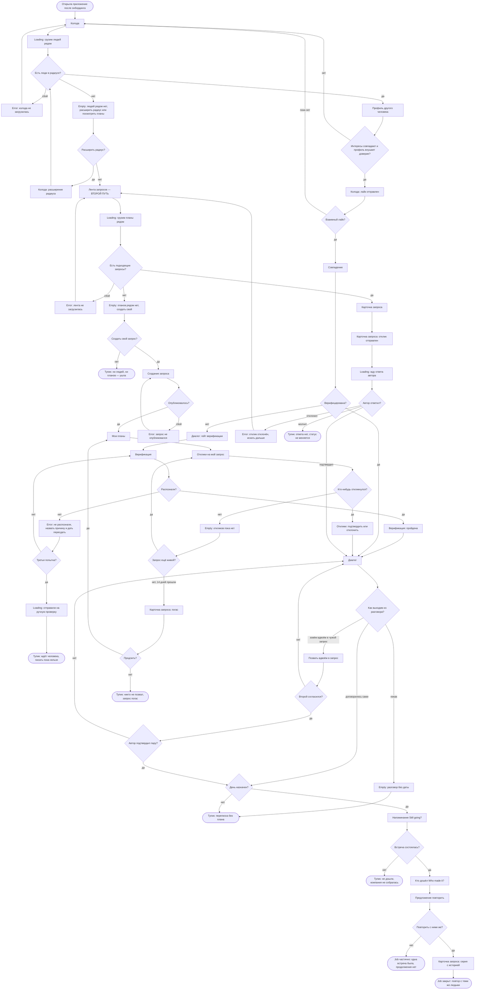
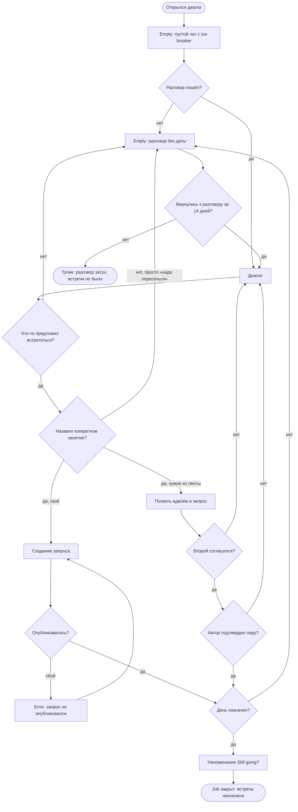
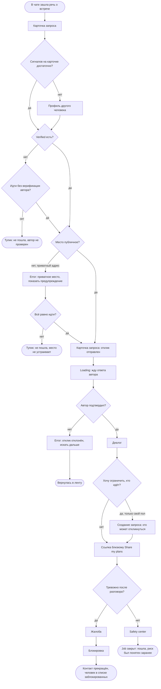
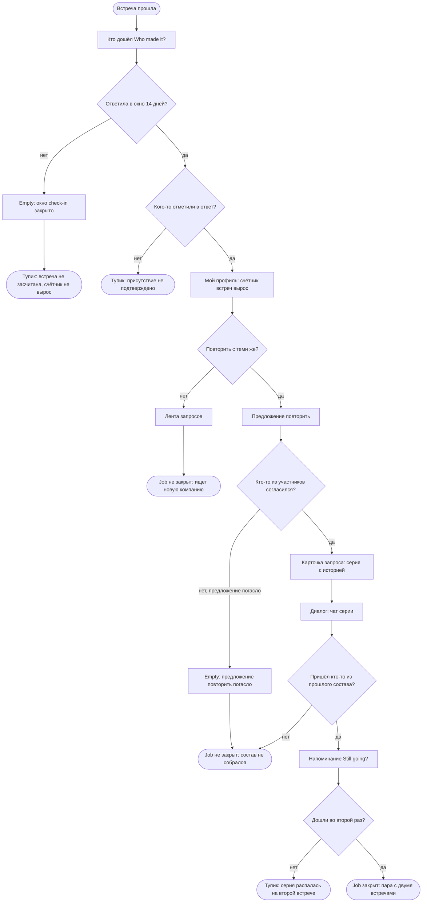
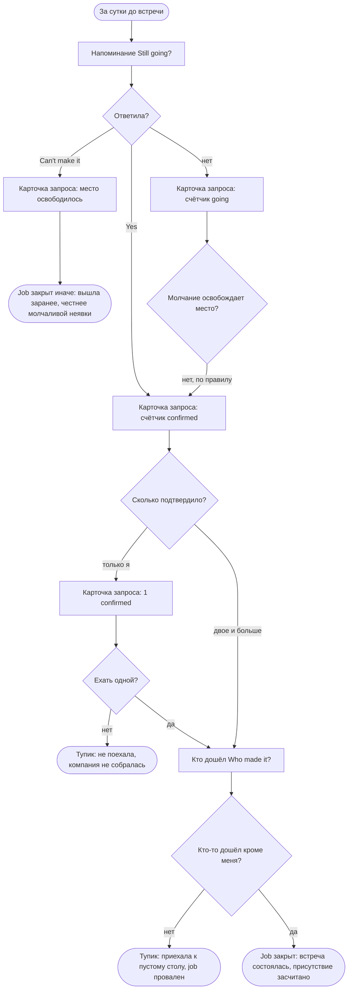

# User flows — MeetMates

> Экраны и состояния — из [`sitemap.md`](./sitemap.md), новых не придумано.
> Jobs — из [`research/jtbd.md`](./research/jtbd.md), решения — [`DECISIONS.md`](./DECISIONS.md).
>
> **Разметка.** Все диаграммы — `flowchart TD`, одна запись на весь файл:
>
> | Запись | Что означает |
> |---|---|
> | `Name([текст])` | начало или конец пути |
> | `Name[текст]` | экран |
> | `Name["Loading: …"]` · `["Empty: …"]` · `["Error: …"]` | **состояние** экрана, тип назван в тексте |
> | `Name{вопрос?}` | точка решения |
> | `-->|да\|нет|` | ветвь решения |
> | `(["Job закрыт: …"])` | job закрыт |
> | `(["Тупик: …"])` | **тупик** — человек не может ничего сделать дальше |
>
> Тупики важнее happy-path: именно там продукт теряет человека.
>
> **У каждого потока два блока:** сначала разметка текстом — её видно и можно
> скопировать, — потом та же разметка в блоке `mermaid`, которую GitHub рисует.
> **При правке меняются оба.**

---

## M1 — компания для планов и продолжение

> Когда мне есть куда пойти, но не с кем, я хочу, чтобы у моих планов была компания,
> а у компании — продолжение.

**Кто:** Даша, primary.
**Основной путь — через чат** `D-37`: колода → взаимный свайп → диалог → договорились.
**Второй путь** — лента запросов: он не зависит от взаимности и потому не убран в глубину.
Считается от **пустой колоды**: на старте она увидит именно её (`D-22`).

**Разметка `flowchart TD`:**

```
flowchart TD
    Start([Открыла приложение после онбординга]) --> Deck[Колода]
    Deck --> DeckLoad["Loading: грузим людей рядом"]
    DeckLoad --> HasPeople{Есть люди в радиусе?}

    HasPeople -->|сбой| DeckErr["Error: колода не загрузилась"]
    DeckErr --> Deck
    HasPeople -->|нет| DeckEmpty["Empty: людей рядом нет, расширить радиус или посмотреть планы"]
    HasPeople -->|да| Person[Профиль другого человека]

    DeckEmpty --> WiderRadius{Расширить радиус?}
    WiderRadius -->|да| Radius["Колода: расширение радиуса"]
    Radius --> HasPeople
    WiderRadius -->|нет| Feed

    Person --> Trust{Интересы совпадают и профиль внушает доверие?}
    Trust -->|нет| Deck
    Trust -->|да| Like["Колода: лайк отправлен"]
    Like --> Mutual{Взаимный лайк?}
    Mutual -->|пока нет| Deck
    Mutual -->|да| Match[Совпадение]

    Match --> IsVerified{Верифицирована?}
    IsVerified -->|нет| Gate["Диалог: гейт верификации"]
    Gate --> Verify[Верификация]
    Verify --> Recognised{Распознали?}
    Recognised -->|да| VerifyOk["Верификация: пройдена"]
    VerifyOk --> Dialog
    Recognised -->|нет| VerifyFail["Error: не распознали, назвать причину и дать пересдать"]
    VerifyFail --> ThirdTry{Третья попытка?}
    ThirdTry -->|нет| Verify
    ThirdTry -->|да| Manual["Loading: отправили на ручную проверку"]
    Manual --> StuckManual(["Тупик: ждёт человека, писать пока нельзя"])
    IsVerified -->|да| Dialog[Диалог]

    Dialog --> Exit{Как выходим из разговора?}
    Exit -->|никак| DeadChat["Empty: разговор без даты"]
    DeadChat --> StuckNoPlan(["Тупик: переписка без плана"])
    Exit -->|договорились сами| DateSet
    Exit -->|зовём вдвоём в чужой запрос| Pair[Позвать вдвоём в запрос]

    Pair --> SecondAgrees{Второй согласился?}
    SecondAgrees -->|нет| Dialog
    SecondAgrees -->|да| AuthorPair{Автор подтвердил пару?}
    AuthorPair -->|нет| Dialog
    AuthorPair -->|да| DateSet{День назначен?}

    DateSet -->|нет| StuckNoPlan
    DateSet -->|да| Remind[Напоминание Still going?]
    Remind --> Happened{Встреча состоялась?}
    Happened -->|нет| StuckNoShow(["Тупик: не дошли, компания не собралась"])
    Happened -->|да| WhoMade[Кто дошёл Who made it?]
    WhoMade --> Offer[Предложение повторить]
    Offer --> Again{Повторить с ними же?}
    Again -->|нет| WinOnce(["Job частично: одна встреча была, продолжения нет"])
    Again -->|да| Series["Карточка запроса: серия с историей"]
    Series --> WinRepeat(["Job закрыт: повтор с теми же людьми"])

    Feed[Лента запросов — ВТОРОЙ ПУТЬ] --> FeedLoad["Loading: грузим планы рядом"]
    FeedLoad --> HasPlans{Есть подходящие запросы?}
    HasPlans -->|сбой| FeedErr["Error: лента не загрузилась"]
    FeedErr --> Feed
    HasPlans -->|да| PlanCard[Карточка запроса]
    HasPlans -->|нет| FeedEmpty["Empty: планов рядом нет, создать свой"]

    FeedEmpty --> CreateOwn{Создать свой запрос?}
    CreateOwn -->|нет| StuckNothing(["Тупик: ни людей, ни планов — ушла"])
    CreateOwn -->|да| Create[Создание запроса]
    Create --> Published{Опубликовалось?}
    Published -->|сбой| CreateErr["Error: запрос не опубликовался"]
    CreateErr --> Create
    Published -->|да| MyPlans[Мои планы]
    MyPlans --> Responses[Отклики на мой запрос]
    Responses --> AnyResponse{Кто-нибудь откликнулся?}
    AnyResponse -->|нет| RespEmpty["Empty: откликов пока нет"]
    RespEmpty --> StillAlive{Запрос ещё живой?}
    StillAlive -->|да| Responses
    StillAlive -->|нет, 14 дней прошли| Expired["Карточка запроса: погас"]
    Expired --> Extend{Продлить?}
    Extend -->|да| MyPlans
    Extend -->|нет| StuckNoOne(["Тупик: никто не позвал, запрос погас"])
    AnyResponse -->|да| Confirm["Отклики: подтвердить или отклонить"]
    Confirm --> Dialog

    PlanCard --> Ask["Карточка запроса: отклик отправлен"]
    Ask --> Wait["Loading: жду ответа автора"]
    Wait --> AuthorReplied{Автор ответил?}
    AuthorReplied -->|отклонил| Rejected["Error: отклик отклонён, искать дальше"]
    Rejected --> Feed
    AuthorReplied -->|молчит| StuckSilence(["Тупик: ответа нет, статус не меняется"])
    AuthorReplied -->|подтвердил| Dialog
```

**Как это выглядит:**



**Оба пути сходятся в диалоге.** Дальше — одинаково: разговор, выход из него в день,
встреча, повтор. Это и есть смысл `D-37`: чат не финал знакомства, а дорога к встрече.

**Точки решения.**

1. **Люди в радиусе есть?** — на старте чаще «нет»: плотность главный риск (`D-02`).
2. **Расширить радиус?** — спрашиваем один раз, дальше помним (`D-11`).
3. **Интересы совпадают и профиль внушает доверие?** — на карточке первой строкой
   общие интересы (`D-13`), под ними четыре сигнала доверия (правило 12).
4. **Взаимный лайк?** — **не тупик, а ожидание**, и это цена `D-37`: основной путь
   упирается в чужое решение. Второй путь от взаимности не зависит.
5. **Верифицирована?** — гейт срабатывает в момент максимальной мотивации (`D-03`).
6. **Как выходим из разговора?** — три выхода: договориться самим, позвать друг друга
   вдвоём в чужой запрос (`D-36`), никак. Третий — провал R1.
7. **Второй согласился?** и **автор подтвердил пару?** — пара атомарна: берут обоих
   или никого (`D-36`).
8. **Дата назначена?** — без даты нечего напоминать и нечего засчитывать (`D-23`).
9. **Повторить с ними же?** — единственный переход, который двигает M1 по существу.

**Состояния в потоке.** Загрузка колоды и ленты · пусто в колоде, ленте и откликах ·
ошибка загрузки колоды и ленты · ошибка публикации · расширение радиуса · лайк отправлен ·
гейт верификации · не распознали · на ручной проверке · **разговор без даты** ·
ждёт согласия второго · жду ответа · отклик отклонён · запрос погас.

**Шесть тупиков.**

| Тупик | Где | Чем дорог |
|---|---|---|
| Ждёт ручной проверки | Верификация | Писать нельзя, а матч уже есть |
| **Переписка без плана** | Диалог | **Главный тупик основного пути**: разговор состоялся, встречи нет |
| Не дошли | После напоминания | Договорились и не встретились |
| Ни людей, ни планов | Пустая лента | Старт, когда база пуста |
| Никто не позвал | Свой запрос погас | Вложилась в создание — ноль откликов |
| Автор молчит | Отклик | Статус не меняется, выхода из состояния нет |

**«Взаимного лайка нет» тупиком не считается** — это ожидание, из которого колода
выводит обратно. Тупик там, где человек **не может ничего сделать дальше**.

---

## R1 — довести разговор до встречи

> Когда мы совпали и переписка идёт, а до встречи не доходит — «надо как-нибудь
> пересечься» и тишина, — я хочу, чтобы у разговора был выход в конкретный день.

**Кто:** Даша и Оля. **Центральный job основного пути** `D-37`: всё, что до диалога,
ведёт сюда, всё, что после, — уже следствие.

**Разметка `flowchart TD`:**

```
flowchart TD
    Start([Открылся диалог]) --> Empty["Empty: пустой чат с ice-breaker"]
    Empty --> Started{Разговор пошёл?}
    Started -->|нет| Dead
    Started -->|да| Dialog[Диалог]

    Dialog --> Proposed{Кто-то предложил встретиться?}
    Proposed -->|нет| Dead["Empty: разговор без даты"]
    Proposed -->|да| HasActivity{Названо конкретное занятие?}

    HasActivity -->|нет, просто «надо пересечься»| Dead
    HasActivity -->|да, своё| Create[Создание запроса]
    HasActivity -->|да, чужое из ленты| Pair[Позвать вдвоём в запрос]

    Create --> Published{Опубликовалось?}
    Published -->|сбой| CreateErr["Error: запрос не опубликовался"]
    CreateErr --> Create
    Published -->|да| DateSet

    Pair --> SecondAgrees{Второй согласился?}
    SecondAgrees -->|нет| Dialog
    SecondAgrees -->|да| AuthorPair{Автор подтвердил пару?}
    AuthorPair -->|нет| Dialog
    AuthorPair -->|да| DateSet{День назначен?}

    DateSet -->|нет| Dead
    DateSet -->|да| Remind[Напоминание Still going?]
    Remind --> Win(["Job закрыт: встреча назначена"])

    Dead --> Revived{Вернулись к разговору за 14 дней?}
    Revived -->|да| Dialog
    Revived -->|нет| Stuck(["Тупик: разговор затух, встречи не было"])
```

**Как это выглядит:**



**Точки решения.**

1. **Разговор пошёл?** — ice-breaker в пустом чате существует ради этой развилки.
2. **Кто-то предложил встретиться?** — самый частый провал в категории:
   «we should definitely grab a coffee… no date is set, the conversation dies»
   (FirstMove, **C**).
3. **Есть конкретное занятие?** — «надо пересечься» это **не** выход: по `D-23`
   занятие обязательно, и здесь та же граница, что между запросом и анкетой.
4. **Своё или чужое?** — два выхода из чата: создать свой план или позвать друг друга
   в чужой вдвоём (`D-36`).
5. **День назначен?** — дата появляется при договорённости, а не при создании (`D-23`).

**Состояния.** Пустой диалог с ice-breaker · **разговор без даты** ·
ошибка публикации · ждёт согласия второго.

**Один тупик, и он же главный тупик продукта:** разговор затух. Формально ничего
не сломалось — люди совпали, поговорили, — но M1 не сдвинулся ни на шаг.
**Метрика:** доля диалогов, дошедших до назначенного дня; в §11 её пока нет `[?]`.

---

## R2 — решиться идти

> Когда мы уже списались и пора договариваться о встрече — а всё, что я о нём знаю,
> он рассказал о себе сам, — я хочу понимать, чем рискую, до того как соглашусь
> на место и время.

**Кто:** Даша, primary.

**Разметка `flowchart TD`:**

```
flowchart TD
    Start([В чате зашла речь о встрече]) --> PlanCard[Карточка запроса]
    PlanCard --> WhoAuthor{Сигналов на карточке достаточно?}
    WhoAuthor -->|нет| Person[Профиль другого человека]
    WhoAuthor -->|да| HasVerified{Verified есть?}
    Person --> HasVerified

    HasVerified -->|нет| GoAnyway{Идти без верификации автора?}
    GoAnyway -->|нет| StuckUnverified(["Тупик: не пошла, автор не проверен"])
    GoAnyway -->|да| IsPublic{Место публичное?}
    HasVerified -->|да| IsPublic

    IsPublic -->|нет, приватный адрес| Warn["Error: приватное место, показать предупреждение"]
    Warn --> StillGo{Всё равно идти?}
    StillGo -->|нет| StuckPlace(["Тупик: не пошла, место не устраивает"])
    StillGo -->|да| Ask["Карточка запроса: отклик отправлен"]
    IsPublic -->|да| Ask

    Ask --> Wait["Loading: жду ответа автора"]
    Wait --> Confirmed{Автор подтвердил?}
    Confirmed -->|нет| Rejected["Error: отклик отклонён, искать дальше"]
    Rejected --> BackToFeed(["Вернулась в ленту"])
    Confirmed -->|да| Dialog[Диалог]

    Dialog --> LimitWho{Хочу ограничить, кто идёт?}
    LimitWho -->|да, только свой пол| Create["Создание запроса: кто может откликнуться"]
    LimitWho -->|нет| Share[Ссылка близкому Share my plans]
    Create --> Share
    Share --> Uneasy{Тревожно после разговора?}
    Uneasy -->|да| Report[Жалоба]
    Report --> Block[Блокировка]
    Block --> StuckBlocked(["Контакт прекращён, человек в списке заблокированных"])
    Uneasy -->|нет| Safety[Safety center]
    Safety --> Win(["Job закрыт: пошла, риск был понятен заранее"])
```

**Как это выглядит:**



**Точки решения.**

1. **Кто автор?** — если четырёх сигналов на карточке мало, человек уходит в профиль целиком.
2. **Verified есть?** — единственный сигнал, который что-то доказывает; и то только живое фото (`D-26`).
3. **Место публичное?** — публичное по умолчанию, приватное показывает предупреждение (`D-07`).
4. **Хочу ограничить, кто идёт?** — только на свой пол (`D-25`); ветка работает, если она автор.
5. **Тревожно после разговора?** — Report и Block доступны с любого экрана (правило 4).

**Состояния.** Предупреждение о приватном месте · жду ответа · отклик отклонён.

**Два тупика, и оба — осознанный отказ, а не сбой:** не пошла, потому что автор
не верифицирован; не пошла, потому что место не устраивает. Продукт их не «чинит» —
он делает так, чтобы решение принималось **дома**, а не у двери.

---

## R4 — увидеться снова, не начиная заново

> Когда встреча прошла хорошо и я хочу повторить — а договариваться заново с каждым
> значит снова писать первой, — я хочу продолжить с теми же людьми без усилия первого раза.

**Кто:** Максим и Оля (secondary), Даша (primary) — источник Холла измерен на переехавших.

**Разметка `flowchart TD`:**

```
flowchart TD
    Start([Встреча прошла]) --> WhoMade[Кто дошёл Who made it?]
    WhoMade --> InWindow{Ответила в окно 14 дней?}
    InWindow -->|нет| Closed["Empty: окно check-in закрыто"]
    Closed --> StuckNotCounted(["Тупик: встреча не засчитана, счётчик не вырос"])
    InWindow -->|да| MarkedBack{Кого-то отметили в ответ?}
    MarkedBack -->|нет| StuckNoProof(["Тупик: присутствие не подтверждено"])
    MarkedBack -->|да| Profile["Мой профиль: счётчик встреч вырос"]

    Profile --> WantAgain{Повторить с теми же?}
    WantAgain -->|нет| Feed[Лента запросов]
    Feed --> NewSearch(["Job не закрыт: ищет новую компанию"])
    WantAgain -->|да| Offer[Предложение повторить]

    Offer --> AnyoneIn{Кто-то из участников согласился?}
    AnyoneIn -->|нет, предложение погасло| OfferDead["Empty: предложение повторить погасло"]
    OfferDead --> SameGone(["Job не закрыт: состав не собрался"])
    AnyoneIn -->|да| Series["Карточка запроса: серия с историей"]
    Series --> SeriesChat["Диалог: чат серии"]
    SeriesChat --> FromBefore{Пришёл кто-то из прошлого состава?}

    FromBefore -->|нет| SameGone
    FromBefore -->|да| Remind[Напоминание Still going?]
    Remind --> SecondTime{Дошли во второй раз?}
    SecondTime -->|нет| StuckFellApart(["Тупик: серия распалась на второй встрече"])
    SecondTime -->|да| Win(["Job закрыт: пара с двумя встречами"])
```

**Как это выглядит:**



**Точки решения.**

1. **Ответила в окно?** — окно 14 дней, пропустить можно; при заполняемости ниже 40 %
   механизм репутации не наполняется (`D-18`).
2. **Кого-то отметили в ответ?** — присутствие засчитано, если отметил хотя бы один другой.
3. **Кто-то согласился?** — предложение повторить приходит **после встречи любому участнику**
   и не зависит от check-in (`D-34`). Прежняя развилка «запрос был помечен как повторяющийся?»
   снята: она спрашивала о повторе до того, как человек мог о нём судить, и роняла R4 тихо.
4. **Пришёл кто-то из прошлого состава?** — вторичный срез метрики повтора (§11).

**Состояния.** Окно check-in закрыто · предложение повторить погасло · серия с историей · чат серии.

**Три тупика.** Не ответила в окно · присутствие не подтвердил никто ·
серия распалась на второй встрече. Первые два — **дыры в измерении**: встреча была,
но продукт о ней не знает, и метрика повтора читается как нижняя граница.

---

## R3 — не приехать к пустому столу

> Когда я решаю, ехать ли на встречу, где записалось восемь незнакомых людей, —
> я хочу быть уверенной, что не окажусь там одна.

**Кто:** Оля и Артём — **secondary-flow** `D-35`. На `+1` пустого стола не бывает:
вопрос «сколько подтвердило» вырождается в «только я или никто».
**Но экран напоминания рисуется сначала под пару** — там молчание единственного участника
означает, что встречи не будет вовсе (`D-24`).

**Разметка `flowchart TD`:**

```
flowchart TD
    Start([За сутки до встречи]) --> Remind[Напоминание Still going?]
    Remind --> Answered{Ответила?}

    Answered -->|нет| Silent["Карточка запроса: счётчик going"]
    Answered -->|Can't make it| Freed["Карточка запроса: место освободилось"]
    Freed --> WinHonest(["Job закрыт иначе: вышла заранее, честнее молчаливой неявки"])
    Answered -->|Yes| Confirmed["Карточка запроса: счётчик confirmed"]

    Silent --> SilenceFrees{Молчание освобождает место?}
    SilenceFrees -->|нет, по правилу| Confirmed

    Confirmed --> HowMany{Сколько подтвердило?}
    HowMany -->|только я| Alone["Карточка запроса: 1 confirmed"]
    Alone --> GoAlone{Ехать одной?}
    GoAlone -->|нет| StuckNotGone(["Тупик: не поехала, компания не собралась"])
    GoAlone -->|да| WhoMade
    HowMany -->|двое и больше| WhoMade[Кто дошёл Who made it?]

    WhoMade --> AnyoneElse{Кто-то дошёл кроме меня?}
    AnyoneElse -->|нет| StuckEmptyTable(["Тупик: приехала к пустому столу, job провален"])
    AnyoneElse -->|да| Win(["Job закрыт: встреча состоялась, присутствие засчитано"])
```

**Как это выглядит:**



**Точки решения.**

1. **Ответила?** — три исхода, и молчание не равно отказу (`D-16`).
2. **Молчание освобождает место?** — **нет**: неответ не проступок, `spots left` не растёт.
3. **Сколько подтвердило?** — на `+1` ответ всегда «только я или никто»,
   поэтому этот flow и не про Дашу `D-35`. Механизм при этом на паре не слабее,
   а сильнее: один неответ означает, что встречи нет.
4. **Кто-то дошёл кроме меня?** — единственная проверка, которая закрывает job фактом.

**Состояния.** Счётчик `going` · счётчик `confirmed` · место освободилось · `1 confirmed`.

**Два тупика.** Не поехала, потому что подтвердил один · приехала к пустому столу.
**Второй — это провал job целиком**, и продукт против него может только предупредить
заранее: показать `confirmed`, а не `going` (`D-16`).

---

## Что эти flows показали

| Находка | Куда идёт |
|---|---|
| **Шесть тупиков в M1**, два из них после того, как человек уже вложился | Проектировать выход из «автор молчит» и «переписка без плана» — §5.4 |
| **Ошибки загрузки и публикации** не были описаны как состояния | Добавлены в `sitemap.md` |
| **«Отклик отклонён» и «отклики: пусто»** не были состояниями | Добавлены в `sitemap.md` |
| ~~R4 ломается на развилке «запрос не был помечен повторяющимся»~~ | **Решено `D-34`:** повтор предлагается после встречи, начать может любой участник |
| ~~R3 на `+1` вырождается~~ | **Решено `D-35`:** R3 остаётся групповым, но экран напоминания рисуется pair-first |
| **Главный тупик продукта — «разговор без даты»** | Стал именованным состоянием диалога; выход из чата спроектирован в §5.3 |
| **У R1 не было метрики**, хотя после `D-37` это центральный job основного пути | **Добавлена в §11:** доля диалогов, дошедших до назначенного дня |
| **«Взаимного лайка нет» — не тупик, а ожидание** | Цена `D-37`: основной путь упирается в чужое решение, поэтому второй путь остаётся глобальным |
| **Теги дерева экранов отстали от `D-37`**: колода и вход несли R1 в старом смысле, а поток R1 через них не идёт | Сверка потоков с матрицей — `sitemap.md`, «Трассировка → Проверка потоками»; теги девяти экранов выровнены |
